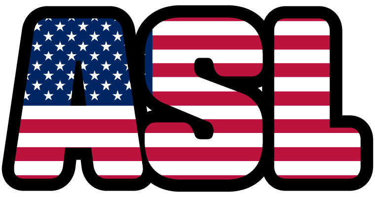
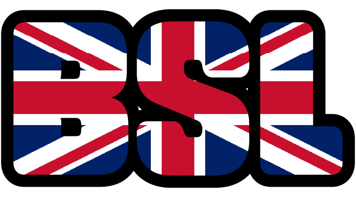
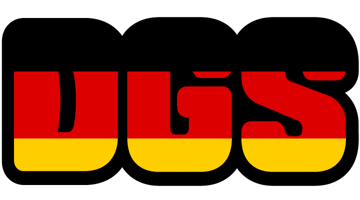
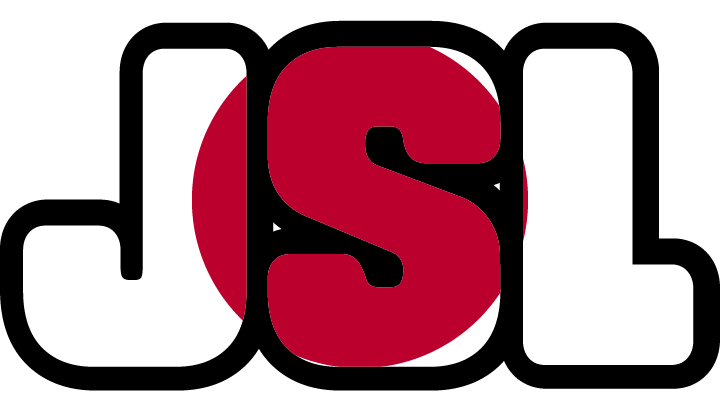
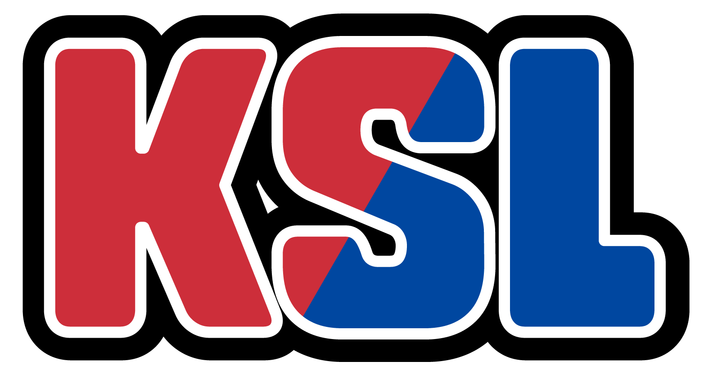
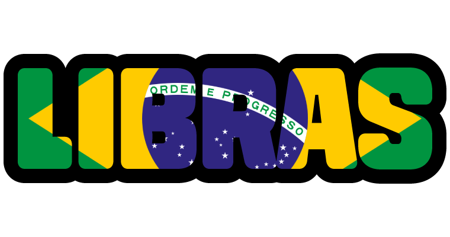
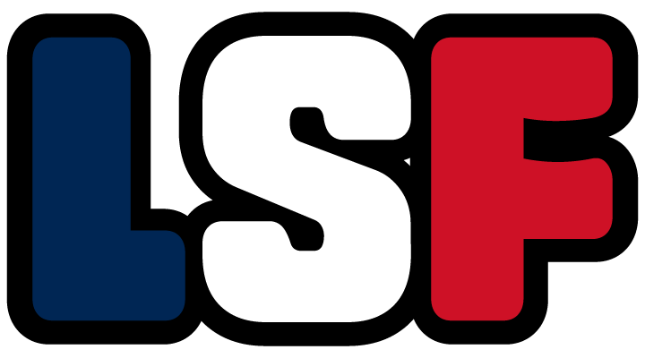
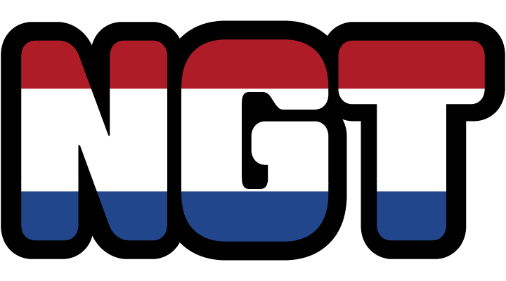

## 🌍 Global Sign Language Typo Badges


각국 수어를 상징하는 국가 패치와 알파벳 타이포그래피를 결합하여 직접 제작한 오픈소스 그래픽 자산입니다.  
VRChat 월드 내 언어 안내 포스터, 디스코드 커뮤니티 역할(Role) 아이콘, 이모티콘 등 자유롭게 활용하실 수 있습니다.

---

## 🎨 자산 미리보기 및 다운로드 (Assets Preview)

각 이미지 미리보기 및 파일명을 클릭하여 원본 PNG 파일을 다운로드하실 수 있습니다.
> 다른 국가의 수어 배지가 필요하신가요? [Issues]를 열어 요청해 주세요!

| 약어 | 미리보기 (Preview) | 수어 명칭 (Full Name) | 파일 링크 (Download) |
| :---: | :---: | :--- | :---: |
| **ASL** |  | American Sign Language (미국 수어) | [ASL.png](./assets/png/ASL.png) |
| **BSL** |  | British Sign Language (영국 수어) | [BSL.png](./assets/png/BSL.png) |
| **DGS** |  | Deutsche Gebärdensprache (독일 수어) | [DGS.png](./assets/png/DGS.png) |
| **JSL** |  | Japanese Sign Language (일본 수어) | [JSL.png](./assets/png/JSL.png) |
| **KSL** |  | Korean Sign Language (한국 수어) | [KSL.png](./assets/png/KSL.png) |
| **Libras** |  | Língua Brasileira de Sinais (브라질 수어) | [Libras.png](./assets/png/Libras.png) |
| **LSF** |  | Langue des Signes Française (프랑스 수어) | [LSF.png](./assets/png/LSF.png) |
| **NGT** |  | Nederlandse Gebarentaal (네덜란드 수어) | [NGT.png](./assets/png/NGT.png) |

> 📦 **일러스트 원본 파일 (.AI):** Vector 수정을 위한 원본 파일은 [`./assets/vector/sign_language_badges.ai`](./assets/vector/sign_language_badges.ai) 경로에서 다운로드하실 수 있습니다.

---

## 📜 라이선스 및 이용 규칙 (License)

본 자산은 **CC BY 4.0 (Creative Commons Attribution 4.0 International)** 라이선스에 따라 제공됩니다.

- **자유로운 이용:** 사전 승인 없이 상업적/비상업적 프로젝트 활용, 수정, 재배포가 모두 가능합니다.
- **출처 표기 의무:** 자산을 사용할 경우 원작자 이름과 본 저장소 주소를 포함한 출처 표기를 남겨주셔야 합니다.

### 📌 출처 표기 예시 (Credit Template)

월드 설명란, 게시글, 작품 크레딧 등에 아래 문구를 복사하여 첨부해 주세요.

```text
Sign Language Badges Designed by LeeSimYul
Source: [https://github.com/LeeSimYul/sign-language-badges](https://github.com/LeeSimYul/sign-language-badges)
```
