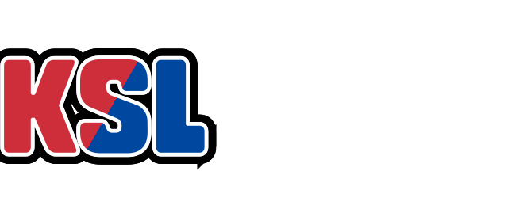
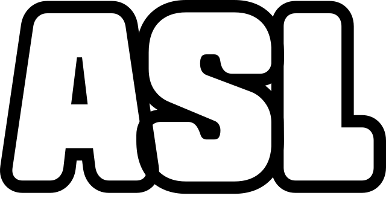
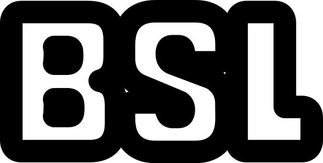
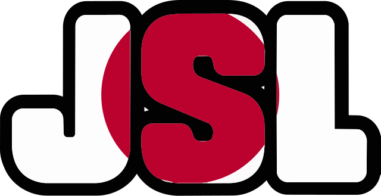
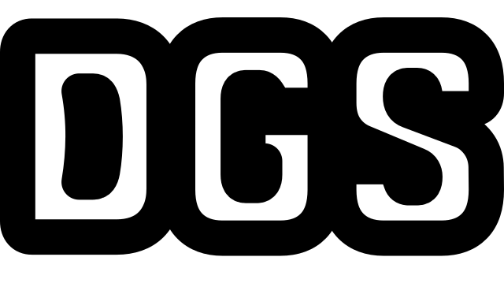
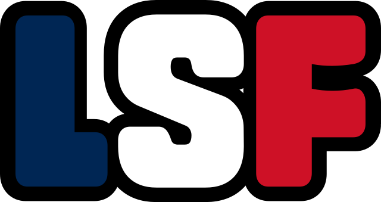
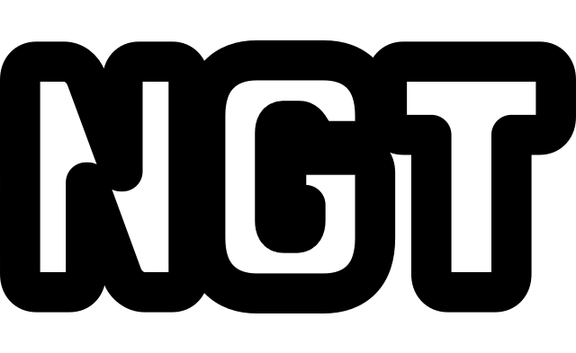
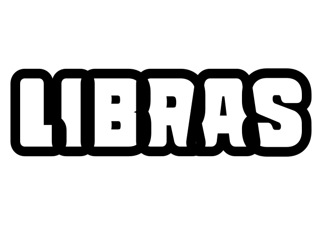

<div align="center">

# 🌍 Global Sign Language Typo Badges

**각국 수어를 상징하는 국가 패치와 알파벳 타이포그래피를 결합한 오픈소스 그래픽 자산**

[](./LICENSE)
[](#-배지-목록-badge-catalogue)
[](#-배지-목록-badge-catalogue)
[](#-마크다운-스니펫-markdown-embed-snippets)
[](./CONTRIBUTING.md)

<picture><source media="(prefers-color-scheme: dark)" srcset="./assets/export/dark/wide/md/KSL.png"></picture>&nbsp;&nbsp;
<picture><source media="(prefers-color-scheme: dark)" srcset="./assets/export/dark/wide/md/ASL.png"></picture>&nbsp;&nbsp;
<picture><source media="(prefers-color-scheme: dark)" srcset="./assets/export/dark/wide/md/BSL.png"></picture>&nbsp;&nbsp;
<picture><source media="(prefers-color-scheme: dark)" srcset="./assets/export/dark/wide/md/JSL.png"></picture>
<br/><br/>
<picture><source media="(prefers-color-scheme: dark)" srcset="./assets/export/dark/wide/md/DGS.png"></picture>&nbsp;&nbsp;
<picture><source media="(prefers-color-scheme: dark)" srcset="./assets/export/dark/wide/md/LSF.png"></picture>&nbsp;&nbsp;
<picture><source media="(prefers-color-scheme: dark)" srcset="./assets/export/dark/wide/md/NGT.png"></picture>&nbsp;&nbsp;
<picture><source media="(prefers-color-scheme: dark)" srcset="./assets/export/dark/wide/md/Libras.png"></picture>

**한국어 (기본)** · [English](#-english)

</div>

---

VRChat 월드 내 언어 안내 포스터, 디스코드 커뮤니티 역할(Role) 아이콘, 이모티콘, 자막 오버레이 등
**어디에나 자유롭게** 활용하실 수 있습니다. 모든 배지는 **SVG 벡터 원본**에서 생성되며,
라이트 모드와 다크 모드 두 가지 버전을 제공합니다.

> [!NOTE]
> 필요한 수어 배지가 없으신가요? [Issues](https://github.com/LeeSimYul/sign-language-badges/issues)에
> 요청해 주시거나, [기여 가이드](./CONTRIBUTING.md)를 참고하여 직접 만들어 주세요.
> Auslan(호주), LSE(스페인), CSL(중국), ISL(아일랜드/인도/이스라엘), LIS(이탈리아) 등을 기다리고 있습니다.

## 📖 목차

- [배지 목록 (Badge Catalogue)](#-배지-목록-badge-catalogue)
- [마크다운 스니펫 (Markdown Embed Snippets)](#-마크다운-스니펫-markdown-embed-snippets)
- [배지 직접 생성하기 (Badge Generator)](#-배지-직접-생성하기-badge-generator)
- [디렉터리 구조](#-디렉터리-구조)
- [기여하기](#-기여하기)
- [라이선스 및 출처 표기](#-라이선스-및-출처-표기)
- [English](#-english)

---

## 🎨 배지 목록 (Badge Catalogue)

미리보기는 **깃허브 테마에 따라 라이트/다크 버전이 자동으로 전환**됩니다.
원하는 형식의 링크를 클릭하여 원본 파일을 내려받으세요.

| 약어 | 미리보기 (Preview) | 수어 명칭 (Endonym) | 다운로드 |
| :---: | :---: | :--- | :---: |
| **ASL** | <picture><source media="(prefers-color-scheme: dark)" srcset="./assets/export/dark/wide/md/ASL.png"></picture> | American Sign Language<br/><sub>미국 수어</sub> | [SVG](./assets/svg/ASL.svg) · [PNG](./assets/png/ASL.png) · [WebP](./assets/export/light/wide/md/ASL.webp) |
| **BSL** | <picture><source media="(prefers-color-scheme: dark)" srcset="./assets/export/dark/wide/md/BSL.png"></picture> | British Sign Language<br/><sub>영국 수어</sub> | [SVG](./assets/svg/BSL.svg) · [PNG](./assets/png/BSL.png) · [WebP](./assets/export/light/wide/md/BSL.webp) |
| **DGS** | <picture><source media="(prefers-color-scheme: dark)" srcset="./assets/export/dark/wide/md/DGS.png"></picture> | Deutsche Gebärdensprache<br/><sub>독일 수어</sub> | [SVG](./assets/svg/DGS.svg) · [PNG](./assets/png/DGS.png) · [WebP](./assets/export/light/wide/md/DGS.webp) |
| **JSL** | <picture><source media="(prefers-color-scheme: dark)" srcset="./assets/export/dark/wide/md/JSL.png"></picture> | 日本手話 (Nihon Shuwa)<br/><sub>일본 수어</sub> | [SVG](./assets/svg/JSL.svg) · [PNG](./assets/png/JSL.png) · [WebP](./assets/export/light/wide/md/JSL.webp) |
| **KSL** | <picture><source media="(prefers-color-scheme: dark)" srcset="./assets/export/dark/wide/md/KSL.png"></picture> | 한국수어 (Korean Sign Language)<br/><sub>한국 수어</sub> | [SVG](./assets/svg/KSL.svg) · [PNG](./assets/png/KSL.png) · [WebP](./assets/export/light/wide/md/KSL.webp) |
| **Libras** | <picture><source media="(prefers-color-scheme: dark)" srcset="./assets/export/dark/wide/md/Libras.png"></picture> | Língua Brasileira de Sinais<br/><sub>브라질 수어</sub> | [SVG](./assets/svg/Libras.svg) · [PNG](./assets/png/Libras.png) · [WebP](./assets/export/light/wide/md/Libras.webp) |
| **LSF** | <picture><source media="(prefers-color-scheme: dark)" srcset="./assets/export/dark/wide/md/LSF.png"></picture> | Langue des Signes Française<br/><sub>프랑스 수어</sub> | [SVG](./assets/svg/LSF.svg) · [PNG](./assets/png/LSF.png) · [WebP](./assets/export/light/wide/md/LSF.webp) |
| **NGT** | <picture><source media="(prefers-color-scheme: dark)" srcset="./assets/export/dark/wide/md/NGT.png"></picture> | Nederlandse Gebarentaal<br/><sub>네덜란드 수어</sub> | [SVG](./assets/svg/NGT.svg) · [PNG](./assets/png/NGT.png) · [WebP](./assets/export/light/wide/md/NGT.webp) |

> 📦 **일러스트레이터 원본 (.AI):** 벡터 편집용 원본은
> [`assets/vector/sign_language_badges.ai`](./assets/vector/sign_language_badges.ai) 에서 내려받으실 수 있습니다.

---

## 📋 마크다운 스니펫 (Markdown Embed Snippets)

깃허브 프로필, README, 블로그, 노션 등에 **그대로 복사해서 붙여 넣으면 됩니다.**
아래 코드는 모두 이 저장소의 `main` 브랜치를 직접 참조하는 절대 경로를 사용합니다.

<details open>
<summary><b>① 기본 — 마크다운 한 줄 (가장 간단)</b></summary>

```markdown

```

`KSL` 부분을 `ASL`, `BSL`, `DGS`, `JSL`, `Libras`, `LSF`, `NGT` 중 원하는 약어로 바꿔 주세요.

</details>

<details open>
<summary><b>② 크기 지정 — HTML <code>&lt;img&gt;</code></b></summary>

```html

```

`height` 값만 바꾸면 비율은 자동으로 유지됩니다. 권장값: 프로필 배지 `32`, 본문 `48`, 헤더 `80`.

</details>

<details open>
<summary><b>③ 다크모드 자동 전환 — <code>&lt;picture&gt;</code> (추천 ⭐)</b></summary>

깃허브 테마가 다크로 바뀌면 배지도 자동으로 밝은 버전으로 전환됩니다.

```html
<picture>
  <source media="(prefers-color-scheme: dark)"
          srcset="https://raw.githubusercontent.com/LeeSimYul/sign-language-badges/main/assets/export/dark/wide/md/KSL.png">
  
</picture>
```

</details>

<details>
<summary><b>④ 여러 배지 나열 — 배지 줄 (Badge Row)</b></summary>

```html
<p align="center">
  
  
  
  
</p>
```

</details>

<details>
<summary><b>⑤ 링크가 걸린 배지 — 클릭하면 이 저장소로 이동</b></summary>

```markdown
[](https://github.com/LeeSimYul/sign-language-badges)
```

</details>

<details>
<summary><b>⑥ WebP 경량 버전 — 용량 절반 (블로그·웹사이트용)</b></summary>

```html

```

WebP는 PNG 대비 약 **50~60% 가벼우며**, 모든 최신 브라우저에서 지원됩니다.

</details>

<details>
<summary><b>⑦ 출처 표기를 포함한 완성형 블록 (복사 권장 ✅)</b></summary>

```html
<p align="center">
  <picture>
    <source media="(prefers-color-scheme: dark)"
            srcset="https://raw.githubusercontent.com/LeeSimYul/sign-language-badges/main/assets/export/dark/wide/md/KSL.png">
    
  </picture>
  <br/>
  <sub>
    Sign Language Badges by
    <a href="https://github.com/LeeSimYul/sign-language-badges">LeeSimYul</a> ·
    <a href="https://creativecommons.org/licenses/by/4.0/">CC BY 4.0</a>
  </sub>
</p>
```

</details>

> [!TIP]
> **VRChat · Discord 사용자:** 정사각형 아이콘이 필요하다면 아래 명령으로 생성하세요.
> ```bash
> python scripts/generate_badges.py --shapes square --sizes 256 --formats png
> ```

---

## ⚙️ 배지 직접 생성하기 (Badge Generator)

[`scripts/generate_badges.py`](./scripts/generate_badges.py) 는 `assets/svg/` 의 **SVG 원본을 유일한
기준**으로 삼아 PNG·WebP 배지를 생성합니다. 원본과 결과물이 어긋날 일이 없습니다.

### 설치

```bash
pip install -r scripts/requirements.txt
```

> `cairosvg` 는 네이티브 Cairo 라이브러리를 필요로 합니다.
> Ubuntu/Debian: `sudo apt install libcairo2` · macOS: `brew install cairo`

### 사용법

```bash
# 기본값: 8종 × 라이트/다크 × 4가지 크기 × PNG/WebP 전체 생성
python scripts/generate_badges.py

# 특정 배지만, 640px PNG로
python scripts/generate_badges.py --only KSL,ASL --sizes md --formats png

# 디스코드 역할 아이콘용 정사각형 256px
python scripts/generate_badges.py --shapes square --sizes 256 --formats png

# 어두운 배경에 합성된 불투명 배지
python scripts/generate_badges.py --themes dark --background "#0d1117"

# 무엇이 생성될지 미리 확인 (파일 쓰지 않음)
python scripts/generate_badges.py --dry-run
```

### 주요 옵션

| 옵션 | 기본값 | 설명 |
| :--- | :--- | :--- |
| `--only` | 전체 | 생성할 배지 약어 (쉼표 구분) |
| `--themes` | `light,dark` | 테마 |
| `--shapes` | `wide` | `wide`(원본 비율) / `square`(정사각 캔버스) |
| `--sizes` | `xs,sm,md,lg` | `xs`160 · `sm`320 · `md`640 · `lg`1280 또는 픽셀값 직접 지정 |
| `--formats` | `png,webp` | 출력 형식 |
| `--background` | 투명 | 지정 시 해당 색상으로 배경을 채움 |
| `--dark-ink` | `#f5f5f5` | 다크 테마에서 검정 잉크를 대체할 색상 |
| `--dark-paper` | `#12151c` | 다크 테마에서 흰색 면을 대체할 색상 |
| `--clean` | — | 출력 디렉터리를 비우고 새로 생성 |
| `--dry-run` | — | 생성될 파일 목록만 출력 |

전체 옵션은 `python scripts/generate_badges.py --help` 로 확인하실 수 있습니다.

### 다크모드는 어떻게 만들어지나요?

스크립트는 SVG의 **무채색(검정·흰색)만** 골라 반전시키고, **국기 색상은 그대로 보존**합니다.

| 원본 색상 | 다크 테마 결과 | 이유 |
| :--- | :--- | :--- |
| `#000` (검정 키라인) | `#f5f5f5` | 어두운 배경에서 외곽선이 보이도록 |
| `#fff` (흰색 글자 면) | `#12151c` | 흰색이 된 키라인과 뭉치지 않도록 |
| `#cd2e3a` `#0047a0` (태극기 색) | **변경 없음** | 국가 상징색은 보존해야 함 |
| `fill="none"`, `url(#gradient)` | **변경 없음** | 색상이 아니므로 건드리지 않음 |

---

## 📂 디렉터리 구조

```
sign-language-badges/
├── assets/
│   ├── svg/                         # ⭐ 벡터 원본 (모든 배지의 기준)
│   ├── png/                         # 작가가 직접 내보낸 고해상도 PNG
│   ├── vector/                      # 일러스트레이터 작업 원본 (.ai)
│   └── export/                      # 스크립트 생성 결과물
│       ├── light/wide/md/           #   └ 라이트 테마 640px (저장소에 포함)
│       └── dark/wide/md/            #   └ 다크 테마 640px (저장소에 포함)
├── scripts/
│   ├── generate_badges.py           # 배지 생성 스크립트
│   └── requirements.txt             # 스크립트 의존성
├── CONTRIBUTING.md                  # 기여 가이드 (국문/영문)
├── LICENSE                          # CC BY 4.0
└── README.md
```

> `assets/export/` 에는 **640px(`md`) 결과물만 저장소에 포함**되어 있습니다.
> 그 외 크기(`xs`/`sm`/`lg`)와 정사각형 배지는 필요할 때 스크립트로 생성하시면 되며,
> `.gitignore` 에 의해 커밋되지 않습니다.

---

## 🤝 기여하기

새로운 수어 배지 기여를 언제나 환영합니다.
디자인 규격, 폰트 가이드, 파일 네이밍 규칙 등 자세한 내용은
**[CONTRIBUTING.md](./CONTRIBUTING.md)** 를 확인해 주세요. (국문/영문 모두 제공)

요약하면 다음과 같습니다.

1. `assets/svg/<약어>.svg` 에 SVG 원본 **하나만** 추가
2. 잉크는 `#000`, 배경은 투명, 글자는 **아웃라인 변환 필수**
3. `python scripts/generate_badges.py --only <약어>` 실행
4. README 표(국문/영문 양쪽)에 행 추가 후 PR

---

## 📜 라이선스 및 출처 표기

본 자산은 **[CC BY 4.0 (Creative Commons Attribution 4.0 International)](https://creativecommons.org/licenses/by/4.0/)**
라이선스에 따라 제공됩니다. 전문은 [LICENSE](./LICENSE) 파일에서 확인하실 수 있습니다.

| | 내용 |
| :--- | :--- |
| ✅ **허용** | 상업적/비상업적 이용, 수정 및 2차 가공, 재배포, 사전 승인 없는 사용 |
| ⚠️ **의무** | 원작자명과 저장소 출처 표기, 수정 시 수정 사실 명시 |
| ❌ **금지** | 출처 미표기 배포, 추가 제약을 덧붙인 재배포 |

### 출처 표기 예시 (Credit Template)

월드 설명란, 게시글, 작품 크레딧 등에 아래 문구를 복사해 첨부해 주세요.

**텍스트용**

```text
Sign Language Badges Designed by LeeSimYul (CC BY 4.0)
Source: https://github.com/LeeSimYul/sign-language-badges
```

**마크다운용**

```markdown
Sign Language Badges by [LeeSimYul](https://github.com/LeeSimYul/sign-language-badges) · Licensed under [CC BY 4.0](https://creativecommons.org/licenses/by/4.0/)
```

**HTML용**

```html
<sub>Sign Language Badges by <a href="https://github.com/LeeSimYul/sign-language-badges">LeeSimYul</a> · Licensed under <a href="https://creativecommons.org/licenses/by/4.0/">CC BY 4.0</a></sub>
```

---
---

<div align="center">

# 🌐 English

**Open-source typographic badges combining national sign language abbreviations with bold lettering**

[한국어로 돌아가기 ↑](#-global-sign-language-typo-badges)

</div>

<details open>
<summary><h3>📘 English documentation — click to expand / collapse</h3></summary>

### About

Hand-made open graphics that pair each country's sign language abbreviation with
bold typography. Use them freely in VRChat world signage, Discord role icons and
emoji, subtitle overlays, documentation, or anywhere else. Every badge is
generated from a **vector SVG master** and ships in both a light and a dark variant.

> Missing the sign language you need? Open an
> [issue](https://github.com/LeeSimYul/sign-language-badges/issues) or read the
> [contributing guide](./CONTRIBUTING.md) and add it yourself. Auslan, LSE, CSL,
> ISL and LIS are all still waiting for someone.

### Badge catalogue

Previews switch automatically between the light and dark variant with your GitHub theme.

| Abbr. | Preview | Endonym | Download |
| :---: | :---: | :--- | :---: |
| **ASL** | <picture><source media="(prefers-color-scheme: dark)" srcset="./assets/export/dark/wide/md/ASL.png"></picture> | American Sign Language | [SVG](./assets/svg/ASL.svg) · [PNG](./assets/png/ASL.png) · [WebP](./assets/export/light/wide/md/ASL.webp) |
| **BSL** | <picture><source media="(prefers-color-scheme: dark)" srcset="./assets/export/dark/wide/md/BSL.png"></picture> | British Sign Language | [SVG](./assets/svg/BSL.svg) · [PNG](./assets/png/BSL.png) · [WebP](./assets/export/light/wide/md/BSL.webp) |
| **DGS** | <picture><source media="(prefers-color-scheme: dark)" srcset="./assets/export/dark/wide/md/DGS.png"></picture> | Deutsche Gebärdensprache | [SVG](./assets/svg/DGS.svg) · [PNG](./assets/png/DGS.png) · [WebP](./assets/export/light/wide/md/DGS.webp) |
| **JSL** | <picture><source media="(prefers-color-scheme: dark)" srcset="./assets/export/dark/wide/md/JSL.png"></picture> | 日本手話 (Nihon Shuwa) | [SVG](./assets/svg/JSL.svg) · [PNG](./assets/png/JSL.png) · [WebP](./assets/export/light/wide/md/JSL.webp) |
| **KSL** | <picture><source media="(prefers-color-scheme: dark)" srcset="./assets/export/dark/wide/md/KSL.png"></picture> | 한국수어 (Korean Sign Language) | [SVG](./assets/svg/KSL.svg) · [PNG](./assets/png/KSL.png) · [WebP](./assets/export/light/wide/md/KSL.webp) |
| **Libras** | <picture><source media="(prefers-color-scheme: dark)" srcset="./assets/export/dark/wide/md/Libras.png"></picture> | Língua Brasileira de Sinais | [SVG](./assets/svg/Libras.svg) · [PNG](./assets/png/Libras.png) · [WebP](./assets/export/light/wide/md/Libras.webp) |
| **LSF** | <picture><source media="(prefers-color-scheme: dark)" srcset="./assets/export/dark/wide/md/LSF.png"></picture> | Langue des Signes Française | [SVG](./assets/svg/LSF.svg) · [PNG](./assets/png/LSF.png) · [WebP](./assets/export/light/wide/md/LSF.webp) |
| **NGT** | <picture><source media="(prefers-color-scheme: dark)" srcset="./assets/export/dark/wide/md/NGT.png"></picture> | Nederlandse Gebarentaal | [SVG](./assets/svg/NGT.svg) · [PNG](./assets/png/NGT.png) · [WebP](./assets/export/light/wide/md/NGT.webp) |

> 📦 **Illustrator master (.AI):** the editable vector source is at
> [`assets/vector/sign_language_badges.ai`](./assets/vector/sign_language_badges.ai).

### Markdown embed snippets

Copy any of these straight into your GitHub profile, README, blog or Notion page.
Every snippet points at absolute URLs on this repository's `main` branch.

**Simplest — one line of Markdown**

```markdown

```

Swap `ASL` for `BSL`, `DGS`, `JSL`, `KSL`, `Libras`, `LSF` or `NGT`.

**Sized — HTML ``**

```html

```

Set `height` only; the aspect ratio follows. Suggested: `32` for a profile badge,
`48` in body text, `80` for a header.

**Dark-mode aware — `<picture>` (recommended ⭐)**

```html
<picture>
  <source media="(prefers-color-scheme: dark)"
          srcset="https://raw.githubusercontent.com/LeeSimYul/sign-language-badges/main/assets/export/dark/wide/md/ASL.png">
  
</picture>
```

**A row of badges**

```html
<p align="center">
  
  
  
</p>
```

**Linked badge**

```markdown
[](https://github.com/LeeSimYul/sign-language-badges)
```

**Lightweight WebP** — roughly 50–60% smaller than the PNG, supported by every modern browser.

```html

```

**Complete block with attribution (recommended ✅)**

```html
<p align="center">
  <picture>
    <source media="(prefers-color-scheme: dark)"
            srcset="https://raw.githubusercontent.com/LeeSimYul/sign-language-badges/main/assets/export/dark/wide/md/ASL.png">
    
  </picture>
  <br/>
  <sub>
    Sign Language Badges by
    <a href="https://github.com/LeeSimYul/sign-language-badges">LeeSimYul</a> ·
    <a href="https://creativecommons.org/licenses/by/4.0/">CC BY 4.0</a>
  </sub>
</p>
```

### Badge generator

[`scripts/generate_badges.py`](./scripts/generate_badges.py) treats the SVG files in
`assets/svg/` as the single source of truth and renders every PNG and WebP badge
from them, so the exports can never drift from the masters.

```bash
pip install -r scripts/requirements.txt          # cairosvg also needs native Cairo
                                                 # apt: libcairo2 · brew: cairo

python scripts/generate_badges.py                # the full default matrix
python scripts/generate_badges.py --only KSL,ASL --sizes md --formats png
python scripts/generate_badges.py --shapes square --sizes 256 --formats png
python scripts/generate_badges.py --themes dark --background "#0d1117"
python scripts/generate_badges.py --dry-run      # print, write nothing
```

| Option | Default | Description |
| :--- | :--- | :--- |
| `--only` | all | comma separated badge names |
| `--themes` | `light,dark` | which themes to render |
| `--shapes` | `wide` | `wide` keeps the master ratio, `square` centres it on a square canvas |
| `--sizes` | `xs,sm,md,lg` | `xs`160 · `sm`320 · `md`640 · `lg`1280, or any pixel width |
| `--formats` | `png,webp` | output formats |
| `--background` | transparent | flatten onto a solid colour instead |
| `--dark-ink` | `#f5f5f5` | colour the dark theme paints near-black ink in |
| `--dark-paper` | `#12151c` | colour the dark theme paints near-white faces in |
| `--clean` | — | wipe the output directory first |
| `--dry-run` | — | list what would be written |

Run `python scripts/generate_badges.py --help` for the full list.

**How the dark variant is made.** The script inverts only the achromatic parts of
a badge and leaves the national colours alone:

| Source colour | Dark result | Why |
| :--- | :--- | :--- |
| `#000` (black keyline) | `#f5f5f5` | so the outline stays visible on a dark background |
| `#fff` (white letter face) | `#12151c` | so the face does not merge into the now-white keyline |
| `#cd2e3a` `#0047a0` (flag colours) | **unchanged** | national colours must be preserved |
| `fill="none"`, `url(#gradient)` | **unchanged** | not colours, so never touched |

### Repository layout

```
sign-language-badges/
├── assets/
│   ├── svg/                         # ⭐ vector masters — the source of truth
│   ├── png/                         # the author's own high-resolution exports
│   ├── vector/                      # Illustrator working file (.ai)
│   └── export/                      # generated by the script
│       ├── light/wide/md/           #   └ light theme, 640px (tracked in git)
│       └── dark/wide/md/            #   └ dark theme, 640px (tracked in git)
├── scripts/
│   ├── generate_badges.py
│   └── requirements.txt
├── CONTRIBUTING.md                  # contributing guide (Korean / English)
├── LICENSE                          # CC BY 4.0
└── README.md
```

Only the 640px (`md`) exports are tracked. Other sizes and the square shape are
generated on demand and kept out of git by `.gitignore`.

### Contributing

New sign language badges are always welcome. See **[CONTRIBUTING.md](./CONTRIBUTING.md)**
for the design specification, typography guide and naming rules (in Korean and English).

1. Add exactly one SVG master at `assets/svg/<ABBR>.svg`
2. Ink in `#000`, transparent background, **all type converted to outlines**
3. Run `python scripts/generate_badges.py --only <ABBR>`
4. Add a row to both README tables and open a pull request

### Licence and attribution

Released under **[CC BY 4.0](https://creativecommons.org/licenses/by/4.0/)**.
The full text is in [LICENSE](./LICENSE).

| | |
| :--- | :--- |
| ✅ **Permitted** | commercial and non-commercial use, modification, redistribution, no prior approval needed |
| ⚠️ **Required** | credit the author and this repository; state that you changed it if you did |
| ❌ **Not permitted** | redistribution without attribution, or adding further restrictions |

**Credit template**

```text
Sign Language Badges Designed by LeeSimYul (CC BY 4.0)
Source: https://github.com/LeeSimYul/sign-language-badges
```

```markdown
Sign Language Badges by [LeeSimYul](https://github.com/LeeSimYul/sign-language-badges) · Licensed under [CC BY 4.0](https://creativecommons.org/licenses/by/4.0/)
```

</details>

---

<div align="center">
  <sub>
    수어는 언어입니다 · Sign language is language<br/>
    Designed by <b>이심율 (LeeSimYul)</b> · VRChat 한국수어교실 ·
    <a href="https://creativecommons.org/licenses/by/4.0/">CC BY 4.0</a>
  </sub>
</div>
